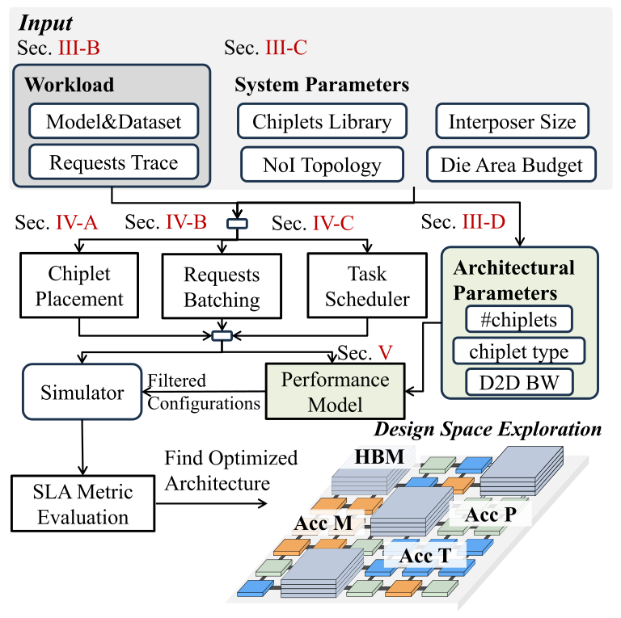
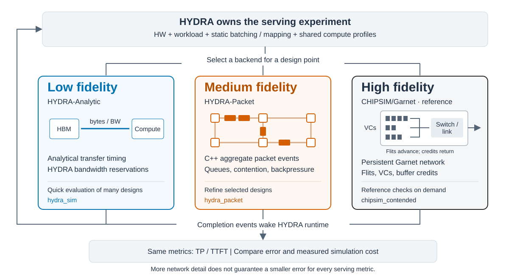

# HYDRA

HYDRA is a design-space exploration framework for hybrid LLM inference on
heterogeneous chiplet systems. It combines a detailed event-driven simulator,
analytical accelerator models, workload traces, and fast DSE models for
exploring hardware composition, placement, scheduling, batching, and NoI
bandwidth.

This repository includes the source code and curated data needed to reproduce
the results in Sections VI-B through VI-F of the paper.

## Framework Overview

HYDRA explores hardware composition, chiplet placement, request batching and
task scheduling under workload and system constraints. The paper's Figure 2
shows how simulation and performance estimation support this search.

<p align="center">
  
</p>

*Figure 2 from the HYDRA paper; [figure source](docs/figures/README.md).*

## Multi-fidelity Validation

For a selected design point, choose **low**, **medium**, or **high network
fidelity**. HYDRA retains the hardware setup, workload, runtime policies and
shared compute profiles. Network completion events feed back into serving to
produce throughput (TP) and time to first token (TTFT).



The high-fidelity path uses CHIPSIM's gem5/Garnet integration. These levels refine
network execution under a shared compute model; CHIPSIM's CMOS/CIMLoop compute
models are not enabled. Select a backend when validation is needed; another
DSE sweep is not required.

**Measured accuracy and simulation cost.** Six paired cases: LLaMA3-8B and
Nemotron-H-4B, three archived designs each, with 5 simulated seconds per run,
static batching/mapping and unpaced network injection. CHIPSIM/Garnet is the
comparison reference.

**Design ordering and trends agree.** Across these six cases, Analytic and
Packet preserve CHIPSIM/Garnet's TP and TTFT ordering within each model. The
sampled TP–TTFT tradeoff trends therefore agree, although the absolute metrics
differ; the table below quantifies these deviations.

| Network fidelity | Backend | TP MAPE | TTFT MAPE | Simulation speedup |
|---|---|---:|---:|---:|
| **Low** | HYDRA-Analytic | 12.71% | 0.52% | 3,737.57× |
| **Medium** | HYDRA-Packet | 7.22% | 0.67% | 16.80× |
| **High (reference)** | CHIPSIM/Garnet | 0% | 0% | 1.00× |

MAPE is measured against CHIPSIM across the six cases. Speedup is the ratio of
summed process wall times, including setup and output, from single measurements
under concurrent load. These are observations for this experiment: finer network detail does not guarantee lower error for
every metric. [Source table and measurement scope](docs/multi_fidelity/README.md#interpretation-and-provenance).

- **[Results and tradeoffs](docs/multi_fidelity/README.md)**: TP–TTFT curves,
  per-metric errors, timing definitions and limitations.
- **[Setup and validation](integrations/README.md)**: backend architecture and
  ordered [Packet](integrations/packet/README.md) / [CHIPSIM](integrations/chipsim/README.md)
  commands.
- **[Detailed tests](tests/validation/packet_validation/README.md)**:
  paired experiments, contention checks, window sensitivity and reproducible evidence.

The layered illustration is inspired by [MFIT](https://arxiv.org/abs/2410.09188);
see the [reference and scope](docs/multi_fidelity/README.md#multi-fidelity-reference).
This optional validation workflow extends the paper's serving simulator.

Experimental [multi-package inference](docs/multi_package/README.md) distributes
one decoder across static layer stages with local HBM and an explicit analytical
package fabric. The [validation record](tests/validation/multi_package/README.md)
covers three-backend smoke and DeepSeek-V3 capacity across four ordinary packages.

Experimental [agent workload replay](docs/agent_workloads/README.md) imports BFCL
multi-turn result logs as dependent LLM calls and profiled host/external tools. The
[integration guide](integrations/workloads/README.md) provides custom Tyro inputs,
a [real Qwen3-8B replay](tests/validation/agent_workloads/real_bfcl/README.md),
and small validation commands for all three backends.

## Environment Setup

The pinned NumPy and SciPy versions in `requirements.txt` require Python 3.11
or newer. Python 3.11 on Linux is recommended.

From the repository root:

```bash
python3.11 -m venv .venv
source .venv/bin/activate
python -m pip install --upgrade pip
python -m pip install -r requirements.txt
python -m pip check
```

Verify the main dependencies and simulator entry point:

```bash
python -c "import matplotlib, networkx, numpy, pandas, scipy, simpy; print('HYDRA environment ready')"
python main.py --help
```

The virtual environment only needs to be activated once per terminal session:

```bash
source .venv/bin/activate
```

## Workload Description

HYDRA combines a model's operator topology with request traces or agent
trajectories. Models and request sources use the existing subclass factories.

### Models

| Model | Implementation in HYDRA |
|---|---|
| LLaMA3-8B | Transformer blocks with analytical attention/FFN profiles and per-request KV storage. |
| Mamba2-3B | Recurrent blocks with convolution/SSM profiles and fixed-size state per sequence. |
| Nemotron-H-4B/56B, Zamba2-7B, Jamba-tiny/mini | Legacy hybrid baselines: configured sequences of attention and recurrent blocks, with block-specific compute and memory profiles. |
| [Qwen3-8B](tests/validation/modern_models/README.md) | Explicit GQA and SwiGLU profiles, KV growth and prompt-sized activation accounting. |
| [Qwen3.5-9B text](tests/validation/modern_models/README.md) | Hybrid Gated DeltaNet and gated GQA blocks; separate recurrent, convolution and KV state accounting. |
| [Kimi Linear 48B-A3B](docs/workload_modernization/kimi/README.md) | Chunked/tiled KDA, MLA and colocated MoE with synthetic routing; explicit operator dependencies and state lifetimes. Includes a streaming MLA variant. |
| [DeepSeek-V3](docs/workload_modernization/deepseek/README.md) | Streaming MLA with absorbed KV cache, dense/grouped MoE layers and synthetic routing; explicit memory-capacity checks. |

Qwen, Kimi and DeepSeek support is experimental and models the decoder stack.
MoE uses colocated experts.

### Benchmarks and datasets

| Benchmark / dataset | Replay in HYDRA |
|---|---|
| [Chat, arXiv, BWB, LongWriter](docs/workload_modernization/dataset_inventory.json) | CSV replay of stored input/output token lengths with configured arrival timing; usable with compatible model/context settings. |
| [BFCL multi-turn trajectories](integrations/workloads/README.md) | Import archived result logs or custom normalized traces; release dependent LLM calls after prior calls, user delays and profiled host/external tool execution complete. Includes synthetic fixtures and pinned Qwen3-8B logs. |

BFCL replays fixed trajectories for performance simulation. Detailed scope,
assumptions and validation commands are linked in the tables. The [workload research report](docs/workload_modernization/README.md)
covers additional architectures and benchmarks under consideration.

## Reproduce the Results

Run the complete standard artifact workflow:

```bash
bash artifact/reproduce_all.sh
```

The driver runs all non-optional experiments from Sections VI-B through VI-F.
It reports the current experiment, progress, completion status, output
locations, and elapsed time. Per-experiment logs and a final summary are
written under:

```text
output_temp_runs/artifact_reproduction/<timestamp>/
```

Reproduced data and figures are written to:

```text
artifact/run_outputs/
artifact/figures/
```

The placement and scheduling comparisons launch several simulations in
parallel. Their concurrency can be adjusted before starting the suite:

```bash
HYDRA_NUM_WORKERS=8 bash artifact/reproduce_all.sh
```

The exhaustive macro-architecture and hybrid-LLM DSE sweeps are intentionally
excluded from this command because they are substantially more expensive.

## Step-by-Step Reproduction

See [artifact/README.md](artifact/README.md) for the paper-section map,
individual `run.sh` commands, expected outputs, and optional exhaustive
procedures.

The standard experiments can also be run independently:

```bash
bash artifact/experiments/vi_b_dse_on_macro_architectures/run.sh
bash artifact/experiments/vi_c_specialization_study/run.sh
bash artifact/experiments/vi_d_e_policy_ablation/run.sh
bash artifact/experiments/vi_d_placement_strategies/run.sh
bash artifact/experiments/vi_e_scheduler_strategies/run.sh
bash artifact/experiments/vi_f_markov_fast_dse/run.sh
```

## Repository Layout

- `main.py`: entry point for one detailed simulation.
- `Sim/`: event-driven simulator, chiplet system, placement, request
  scheduling, task scheduling, batching, and metrics.
- `Sim/backends/`: simulation backend factory and supported-policy checks.
- `Sim/execution/`: shared execution contract and completion feedback.
- `docs/multi_fidelity/`: architecture and curated accuracy/cost evidence.
- `integrations/packet/`: C++ medium-fidelity network, C ABI binding, and validation guide.
- `integrations/chipsim/`: CHIPSIM services and validation guide.
- `third_party/CHIPSIM/`: upstream CHIPSIM submodule.
- `analytic_profile/`: analytical compute and memory models plus hardware
  configuration files.
- `dataset/`: ARXIV, BWB, Chat, and LongWriter request traces.
- `Fast_Estimate/`: Roofline and Markov-based fast-DSE models.
- [`tests/`](tests/README.md): unit tests and simulator validation.
- [`tests/validation/`](tests/validation/README.md): validation scripts and generated demo inputs.
- `artifact/experiments/`: section-level reproduction scripts.
- `artifact/run_outputs/`: curated measurements and generated result tables.
- `artifact/figures/`: reproduced PNG figures.

For a detailed description of the simulator and DSE framework, see
[sim_info.md](sim_info.md).
