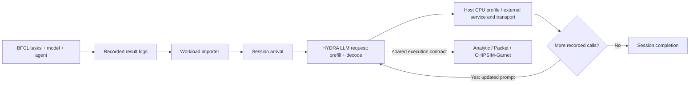

# Agent workload simulation

HYDRA can now replay **BFCL `multi_turn_base` result logs** as dependent sessions.
The importer and three simulation paths are validated with a synthetic format
fixture. A [pinned real Qwen3-8B replay](../../tests/validation/agent_workloads/real_bfcl/README.md)
now validates complete sessions with explicit assumed host-tool profiles.
No task accuracy score is inferred from simulation.
See [setup and commands](../../integrations/workloads/README.md) and the
[validation record](../../tests/validation/agent_workloads/README.md).

## What is being simulated?

A benchmark defines tasks, tools and a correctness evaluator. An agent running a
particular model produces a **trajectory**: several LLM calls, tool executions,
failures/retries and user turns. HYDRA replays that recorded trajectory and
recomputes the LLM execution times on the selected hardware.

For example, an agent may generate `search(...)`, receive a tool result, generate
`lookup(...)`, and finally answer the user. Each generation is an LLM request.
Tool schemas, conversation history and returned text affect the next prompt's
token count. The next call is released only after its predecessor completes and
the tool wait elapses. Independent sessions can overlap.

Replay recomputes the full prompt on every call and releases KV or recurrent
state between calls. The baseline uses the existing static scheduler with
batch size 1, static mapping and pipeline execution. Tool waits consume no
accelerator compute. Tools may use an external delay model or a shared host CPU
profile with bounded workers/workspace; both support payload serialization and
RTT. The host resource is outside the chiplet mesh. Placed CPU area/energy, host
DMA contention with accelerator HBM traffic, shared NICs and general fork/join
graphs require additional models. Prefix retention and recurrent checkpoint
restoration are outside this replay baseline.

BFCL's pinned handler records input/output token counts by turn and step. We use
those counts directly, including any history/schema overhead counted by the
handler. The source model's measured LLM latency is deliberately replaced by
HYDRA execution. BFCL does not supply per-tool timings in this log structure;
the importer requires explicit delays, a timing sidecar, or a tool profile.
Tools within a step execute serially, following the inspected
[BFCL executor](https://github.com/ShishirPatil/gorilla/blob/6ea57973c7a6097fd7c5915698c54c17c5b1b6c8/berkeley-function-call-leaderboard/bfcl_eval/eval_checker/multi_turn_eval/multi_turn_utils.py).

## Metrics and interpretation

- **Per-call TTFT including queueing**: first token minus call release time.
  The existing `metrics.json` TTFT excludes initial scheduler queueing; use
  `agent_metrics.json` for the explicitly named arrival-based metric.
  This is the first generated token, including reasoning, rather than the first
  user-visible final-answer token.
- **Session latency**: session completion minus arrival, including LLM queueing,
  generation, tool waits and configured user think time. Final tool work is
  included even when no following LLM call exists.
- **Token throughput**: output tokens per fixed simulation window. A small
  completed burst followed by idle time is not a sustainable-throughput study.
- **Task correctness**: obtain separately from the benchmark evaluator.
  HYDRA finishing a recorded session says nothing about whether its answer was correct.

Use the same frozen trajectories to compare hardware or network backends. If a
trajectory collected with one model is replayed using another model's compute
configuration, it is a controlled token-workload comparison. It does not predict
the second model's own tool choices, reasoning lengths or benchmark score.

## A small, stable benchmark set

| Benchmark | What it exercises | HYDRA role and status |
|---|---|---|
| [BFCL](https://github.com/ShishirPatil/gorilla/tree/main/berkeley-function-call-leaderboard) | Function calling and multi-turn interaction | `multi_turn_base` result JSONL adapter implemented; pinned archived Qwen3-8B sessions replayed. |
| [AppWorld](https://github.com/StonyBrookNLP/appworld) | Stateful app/API interaction and longer coding-agent tasks | Useful second adapter. Its environment and published experiment outputs can supply trajectories; token/timing coverage must be audited. Not implemented. |
| [MetaTool](https://github.com/HowieHwong/MetaTool) | Whether to use tools and which tools to select | Lightweight tool-selection workload. It does not by itself provide a complete executed multi-step agent trace. Not implemented. |

This selection covers short tool decisions, controlled multi-turn calls and
longer stateful tasks. Benchmark version, model/tokenizer/template, sampling,
task IDs, failures and delay assumptions belong in each experiment manifest.
Adding every new leaderboard is unnecessary for a reproducible hardware study.
