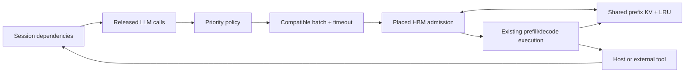

# Agent scheduling and prefix KV baselines

Select `--cluster-config.local-scheduler agent` to reuse HYDRA's static execution
pipeline with configurable request ordering, partial batches, and optional HBM
prefix retention. These are independent runtime dimensions in the normal
`HPSim_Config`/Tyro DSE setup. The legacy `static` scheduler remains unchanged in
policy and agent replay still defaults to batch size 1 without retention.

## Priority and QoS

All policies are **nonpreemptive admission baselines**. They rank released calls;
they do not interrupt an active batch or reserve resources for an entire session.
Ties use arrival time and request ID. Let W be the current call's queue wait,
S its estimated service time, D the absolute session deadline, and t current time.

| `priority` | Ordering | What it measures |
|---|---|---|
| `fcfs` | Earliest call arrival | Queue-order reference |
| `sjf` | Smallest S | Estimated current-call cost |
| `hrrn` | Largest `(W + S) / S` | Short-call preference with waiting-time aging |
| `edf` | Smallest D | Session completion urgency |
| `least_slack` | Smallest `D - t - S` | Deadline slack after estimated current call |

`AgentSession.slo_s` is a relative **end-to-end session** target, including all
tool waits and user think times. Its deadline is arrival + SLO; the configured
`default_session_slo_s` applies when the trace omits it. A later call inherits
the same deadline. Unknown future calls/tools are not included in S; least-slack
therefore does not estimate remaining whole-session work. These adaptations do
not inherit EDF's preemptive uniprocessor optimality guarantees.

The default estimate is `uncached_prompt_tokens * prefill_token_s +
estimated_output_tokens * decode_token_s`. Coefficients are explicit assumptions,
not an automatically calibrated hardware predictor. A positive per-step
`estimated_service_s` overrides it. `service_estimator=oracle_output` explicitly
uses the recorded output length instead of the configured estimate. All scores
and estimates are exported per admitted call.

For memory admission, recorded output lengths are known in both estimator modes:
the scheduler conservatively reserves each request's peak state, scratch and
handoff buffers. This is offline known-length admission, not online paged KV
allocation. Reservation failure evicts unreferenced cache entries or reduces the
batch size; an individually impossible request fails explicitly when no active
batch can free memory. An oversized highest-priority call can cause head-of-line
blocking while other batches run.

## Batching

`batch_size` is a maximum. `batching=immediate` runs the available compatible
subset; `timeout` waits up to `max_batch_wait_s` before flushing a partial batch.
The wait starts at call release and is checked on HYDRA scheduler ticks (currently
100 microseconds). A single remaining session can progress without filling a
batch. `max_active_batches=0` uses existing hardware/worker limits; a positive
value adds a runtime concurrency cap.

The highest-ranked call anchors the batch; other calls must have identical
prompt/context lengths and cached-prefix lengths. Output lengths may differ and
requests finish independently. This uses the existing representative batch
profile without treating heterogeneous prompts as equal work. Compatible calls
may pass incompatible calls while filling a batch. Continuous batching, chunked
prefill and arbitrary ragged batches are not modeled here.

## HBM prefix cache

`prefix_cache=lru` and `prefix_capacity_bytes>0` enable bounded, whole-prefix
retention for **dense ModernGQA/SwiGLU models**, including Qwen3-8B. A normalized
step declares `prefix_id` and `prefix_tokens`; the identity must guarantee equal
token IDs and model/tokenizer/template/tenant semantics. It is trusted trace
metadata, not a hash inferred by HYDRA. Every occurrence of an ID must use the
same prefix length, strictly shorter than the full prompt so at least one query
token computes the first output. Separate model simulations have separate caches.

Completed calls publish prefixes at their existing layer/HBM placement. Cache
hits pin one shared physical KV allocation and reserve only private suffix KV;
active references cannot be evicted. Completion releases the reference, and LRU
evicts unreferenced entries under cache or placed-memory pressure. Retention is
modeled as ownership transfer without copying. Concurrent cold calls may compute
duplicate prefixes; only one completed entry is retained. Overlapping prefixes
with different IDs remain distinct entries. No generated-token prefix extension,
block paging, radix longest-match search, or cross-layer migration is modeled.

For a hit of P tokens in a prompt of L tokens, Q=L-P queries execute. Projections
and FFN scale with Q, attention includes `Q*P + Q*(Q+1)/2` causal pairs, and the
HBM profile still reads historical KV. Decode retains the full context length.
All three network backends consume these same compute/memory profiles.

The cache occupies **real placed HBM capacity and admission reservations**.
SRAM remains the profile's on-chip working-set/spill model; it is not a second
persistent KV tier. Optional `lru_offload` adds a host DRAM tier with explicit
copy delays; see [host offload and continuous batching](runtime_evolution/README.md).
KDA/GDN/MLA prefix
restoration is rejected until their state and cache semantics are implemented.
Priority and compatible batching can still be used with those models with cache
disabled. This agent scheduler is currently validated on one package.

The archived BFCL logs do not contain sufficient tokenized prompt snapshots to
establish prefix identity. Their real replay uses recomputation. Prefix studies
use explicitly synthetic identities; custom logs may supply verified identities.

## Evidence and extension

See [commands, results and validation](../../../tests/validation/agent_workloads/scheduling/README.md).
The study reports queue-inclusive TTFT, session latency/SLO attainment, throughput,
actual batch membership, cache hits/evictions, retained HBM and wall time.
Network timing can change batch membership through dependent call arrivals;
cross-fidelity shifts consequently include that runtime feedback.

New policies subclass `BaseAgentPriority`, `BaseAgentBatching`, or
`BasePrefixCache`, using their factories. `AgentReplicaScheduler` inherits
`StaticReplicaScheduler`; its reservation hook leaves the legacy policy intact.
`AgentRequest` preserves the original request lifecycle and completion event.

Conceptual references: Brinch Hansen, *An Analysis of Response Ratio Scheduling*
(IFIP 1971); Liu and Layland, [*Scheduling Algorithms for Multiprogramming in a
Hard-Real-Time Environment*](https://doi.org/10.1145/321738.321743) (1973).
Prefix sharing/retention follows the general principles described by
[SGLang/RadixAttention](https://arxiv.org/abs/2312.07104) and
[vLLM prefix caching](https://docs.vllm.ai/en/latest/design/prefix_caching/).
HYDRA implements the limited surrogate above, not either serving engine.

## Continuous variant

The [real BFCL runtime trade study](../../../tests/validation/agent_workloads/bfcl_trade/README.md)
compares priorities, whole-call concurrency and continuous resident caps on four
complete Qwen3-8B sessions. It includes queue-inclusive TTFT, session latency,
actual batch occupancy and simulation cost, with caching disabled.

Use `vllm_latest` for real iteration-level batching; `agent` retains the whole-call
baseline described above. The paper `vllm` variant remains isolated and unchanged.
See [runtime contracts and limits](runtime_evolution/README.md) and
[reproduction checks](../../../tests/validation/agent_workloads/continuous/README.md).
