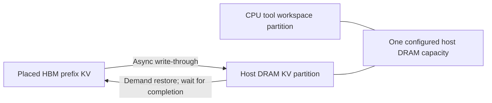

# Host offload and continuous batching

This note describes the implemented host tier and continuous batching, and the
deferred recurrent-state restoration design. HYDRA models performance and state
ownership; it does not run a serving engine or real model tensors.

## Implemented: host DRAM prefix offload

`prefix_cache=lru_offload` extends `LRUPrefixCache` through the existing factory.
The modeled host defaults to **256 GiB DRAM**. CPU tool `memory_bytes` is reserved
as a workspace partition; the remaining host capacity is available to cached KV.
For example, the validation profile reserves 4 GiB for tools, leaving 252 GiB for
KV. Unused tool quota is not dynamically borrowed by KV. Existing tool worker
and workspace contention remain in effect within that quota.

Completed immutable prefixes are written through to host memory. Each tier has
LRU eviction; source and destination allocations remain pinned during a copy.
A restore reserves placed HBM before copying and keeps it pinned until admission.
The scheduler holds that chosen request through restoration, avoiding repeated
reordering/reloading as its estimated prefill cost changes. Other running batches
continue. Failed hot admission can fall back to recompute instead of repeatedly
restoring an entry that cannot fit with private working memory.

Transfers use one shared, serialized bidirectional alpha-beta resource:

`time = startup + bytes / min(host_link_bandwidth, host_dram_bandwidth)`

The defaults (25 GB/s link, 100 GB/s DRAM, 10 us startup) are **assumptions**, not
measured CPU/PCIe specifications. Bandwidth units are decimal GB/s. The transfer
model is shared by all three fidelity backends and sits outside their NoI/Garnet
and HBM-port queues. It does not model a placed CPU chiplet, CPU area/energy,
DMA interference with accelerator HBM traffic, tool memory bandwidth, NUMA,
full-duplex links, SSD storage, or swapping a live request's private KV.

The tier preserves the existing dense GQA/SwiGLU and explicit prefix-identity
requirements. CPU capacity alone does not make a request fit HBM: its active
working state still must fit. Slow copies may retain HBM longer, block admission,
and cost more than recomputation. This baseline always restores an available
host hit; it does not predict whether restoration is profitable.

With `stop_when_complete`, the run drains background cache copies after session
completion. Session latency excludes a final background copy that does not block
the session; whole-run throughput includes that final drain. Fixed cutoffs expose
unfinished copies and pins in the report rather than silently completing them.

See [reproduction, capacity/BW study and checks](../../../../tests/validation/agent_workloads/offload/README.md).
The design uses the tier/copy concepts described by
[SGLang HiCache](https://docs.sglang.io/docs/advanced_features/hicache_design),
with a deliberately smaller whole-prefix simulation contract.

## Implemented: iteration-level continuous batching

Select `--cluster-config.local-scheduler vllm_latest`. The existing scheduler
factory now creates an iteration scheduler and its `ContinuousProcessing`
executor. The executor reuses the same physical block/network execution path;
private KV, handoff buffers and reservations survive between iterations.
Completed requests release their slots, allowing later arrivals to join a live
decode batch. Only completed model iterations generate output tokens.

| Scheduler | Execution contract |
| --- | --- |
| `vllm` | Preserved paper-era dynamic batching; unchanged policy and inherited methods. |
| `vllm_legacy` | Previous `vllm_latest`, including virtual-slot emulation; retained for old experiments. |
| `vllm_latest` | Real iteration boundaries, real request membership and exact token completion. |
| `agent` | Existing nonpreemptive, shape-compatible whole-call batching. |

The paper variant inherits the frozen legacy base, so updates to the latest
scheduler do not propagate into paper reproduction. Legacy emulation is not a
validated agent replay path.

The first implementation uses one replica/package, static mapping and pipeline
execution. `batch_size` caps **resident requests**, not new admissions per tick.
One iteration batch executes at a time (`max_active_batches` must be 0 or 1).
If a slot is free, prefill and decode alternate when both are runnable; a host
restore does not stop resident decode work. Existing priority and timeout
factories control admission. These are simulation baselines, not a reproduction
of the current vLLM serving engine.

- Prefill remains a separate, equal-shape batch, including equal cached lengths.
- Decode can combine different context lengths. Compute/KV traffic use a
  **longest-context padded profile**; physical private KV uses actual lengths.
  This is conservative padding, not an exact ragged-attention kernel model.
- Full private lifetime capacity is reserved using known replay output lengths.
  There is no paged admission, active-KV swapping, chunked prefill or mixed
  prefill/decode kernel. Resident state stays in HBM across scheduling yields.
- Explicit dense-attention prefixes can use `lru` or `lru_offload`. Recurrent
  checkpoints and hybrid prefix restoration remain unsupported.

`continuous_batching.json` records actual members, contexts, stage, start/end
and request completion for each iteration. Agent validation checks one full
iteration per output token, absolute context progression, dependency timing,
copy barriers and complete memory drainage. CSV traces also use this scheduler;
prefix reuse requires the explicit identities of an agent trace.

Iteration completions wake the scheduler immediately. Arrivals and host restore
readiness still use the existing scheduler clock. Batch-size-one model service
matches the original executor, while queue/dispatch overhead can differ.
See [commands and validation evidence](../../../../tests/validation/agent_workloads/continuous/README.md).
The iteration boundary follows the scheduling concept in
[Orca](https://www.usenix.org/conference/osdi22/presentation/yu).

## Proposed next: recurrent checkpoint restoration

**Feasibility: a restricted exact-boundary baseline is practical; arbitrary
prefix reuse is substantially harder.** Full attention stores token-indexed KV.
KDA/GDN hold a mutable recurrent matrix and convolution history. A state after
token P cannot be obtained by truncating the state after token L>P.

The required checkpoint must exist at the exact verified token boundary. Saving
only a request's final state does not create earlier prefix checkpoints. Capturing
one inside prefill requires an explicit split/checkpoint operation and its write
cost. The final generated token also need not have been consumed into the state;
the checkpoint cursor must record processed tokens, not emitted-token count.

Proposed contracts, not implemented classes:

- `FullAttentionCacheContract`: immutable prefix KV, private suffix growth.
- `RecurrentCheckpointContract`: immutable checkpoint plus a private mutable
  restore copy per running request, including convolution state and cursor.
- `HybridCacheCoordinator`: select a boundary supported by every stateful layer;
  a missing required checkpoint causes recomputation from a valid earlier boundary.

KDA lowering currently distinguishes initialized prefill from decode state reads;
GDN similarly initializes state during prefill. Both need an explicit restored
initial-state path. A recurrent restore must retain full private state capacity
and account for copying/reading the checkpoint. Subtracting `prefix_tokens *
state_bytes`, as for attention KV, would be incorrect. Hybrid attention layers
must also use the same absolute positions and full attention context.

Begin with declared checkpoint boundaries for a small GDN or KDA fixture. Compare
`full prefill` against `prefix + snapshot + restored suffix` using a small numeric
reference, then audit the performance graph's state reads/writes, capacity and
copy events. Extend to full Qwen3.5/Kimi and host offload only after this passes.
MLA is a separate attention-cache representation to support, not recurrent state.

[SGLang's cache design](https://www.sglang.io/blog/unified-radix-cache) illustrates
boundary-specific recurrent checkpoints and private continuation state.
[vLLM's hybrid manager design](https://docs.vllm.ai/en/latest/design/hybrid_kv_cache_manager/)
motivates coordinating per-type caches at a common reuse boundary; its document
is explicitly tied to an earlier implementation snapshot, so it is not evidence
that every current architecture is supported.

The existing archived BFCL trajectories still lack sufficient tokenized prompts
to prove cross-call identity. Real-data studies of either mechanism require
verified token IDs/template handling and checkpoint-boundary metadata. Synthetic
fixtures remain appropriate for mechanism validation, with that limitation stated.
