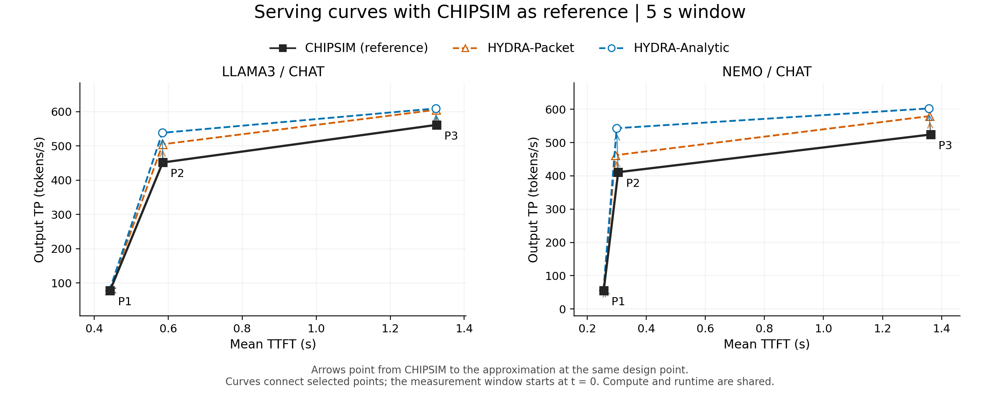
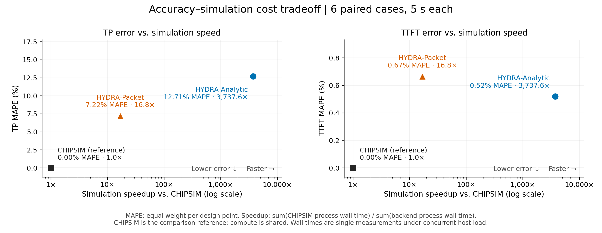
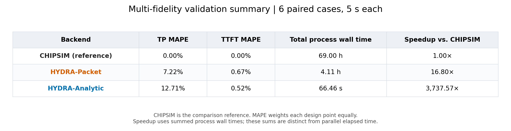

# Multi-fidelity simulation evidence

[Architecture overview](../../README.md#multi-fidelity-validation) ·
[Implementation and extension](../../integrations/README.md) ·
[Detailed validation record](../../tests/validation/packet_validation/README.md)

HYDRA provides three network execution backends: **HYDRA-Analytic**
(`hydra_sim`), **HYDRA-Packet** (`hydra_packet`), and **CHIPSIM/Garnet**
(`chipsim_contended`). Hardware setup, workload, compute profiles, static batching
and offline mapping remain under HYDRA's control. Network completion feeds back
into the same serving runtime. CHIPSIM/Garnet is the reference for the comparisons
below. Existing figures and result tables abbreviate this backend as **CHIPSIM**;
they refer to the same `chipsim_contended` implementation.

HYDRA's execution layer sequences phases and coordinates compute/network
overlap. The CHIPSIM-based integration connects it to a persistent Garnet network,
which models flits, routers, buffers, VCs, and credits. These experiments use
HYDRA compute profiles throughout; CHIPSIM's CMOS analytical and CIMLoop compute
models are not enabled. The comparison measures network refinement and its
effect on serving performance under a shared compute model.

Use Analytic for quick design evaluation, Packet to assess contention at lower
simulation cost, and CHIPSIM for selected reference checks. The measured tradeoff
below determines how much confidence to place in each approximation.

## Experiment

Six complete, paired cases: LLaMA3-8B and Nemotron-H-4B, three archived Pareto
design points per model, the first 32 Chat requests, static batch size 2, static
pipeline mapping, and unpaced network injection. Each run covers **5 simulated
seconds from t = 0**. Effective workload, setup and runtime equivalence were
checked across backends. These are single-package LLaMA/Nemotron experiments.

## Figure 1: TP–TTFT curves



Black squares show CHIPSIM. Colored arrows indicate the shift of the same design
point under Packet or Analytic. Both approximations preserve CHIPSIM's TP and
TTFT ordering across these points at the 5-second cutoff. Lines connect the
selected designs; they do not establish a steady-state Pareto frontier.

[PDF](figures/reference_curves.pdf) · [SVG](figures/reference_curves.svg)

## Figure 2: Accuracy versus simulation speed



Each marker aggregates all six cases. Lower MAPE and higher speedup are preferred.
Packet reduces TP MAPE from 12.71% to 7.22%, while taking 16.80x less total process
wall time than CHIPSIM. TTFT MAPE is 0.67% for Packet and 0.52% for Analytic;
refining the network does not improve every aggregate metric in this experiment.

[PDF](figures/accuracy_vs_speedup.pdf) · [SVG](figures/accuracy_vs_speedup.svg)

## Figure 3: Numerical summary



[PDF](figures/validation_summary_table.pdf) · [SVG](figures/validation_summary_table.svg)
· [Machine-readable table](figures/accuracy_cost_summary.csv)

## Interpretation and provenance

- MAPE is `100 * mean(abs(backend / CHIPSIM - 1))`, weighted equally across
  design points. TP and TTFT errors are reported separately.
- Speedup is `sum(CHIPSIM process wall time) / sum(backend process wall time)`.
  Process wall time includes startup, setup and output. The sum is distinct from
  parallel elapsed time; timings are single measurements under concurrent load.
- Compute profiles are shared. These results support network-refinement and
  serving-feedback comparisons, not independent accelerator compute accuracy.
- TP covers a transient window. TTFT retains HYDRA's scheduling-to-prefill-transition
  convention, excludes queue delay, and includes only samples observed by cutoff.
  The six cases do not establish a general error bound.

The [paired source CSV](data/comparison.csv)
contains per-case metrics, process times and input hashes.
[Figure provenance](figures/accuracy_cost_summary.json) records its SHA-256 and
aggregation definitions. The [full validation report](../../tests/validation/packet_validation/README.md)
includes sample coverage, window sensitivity, contention stress counterexamples
and legacy timing limitations. Setup and simulation commands are in the
[Packet guide](../../integrations/packet/README.md) and
[CHIPSIM guide](../../integrations/chipsim/README.md).

Regenerate all three figures as PNG, PDF and SVG from the repository root,
using the HYDRA Python environment; simulation does not need to be rerun:

```bash
python tests/validation/packet_validation/plot_reference_comparison.py \
  --comparison-csv docs/multi_fidelity/data/comparison.csv \
  --window 5 --figure-set documentation \
  --output-dir docs/multi_fidelity/figures
```

## Multi-fidelity reference

[MFIT: Multi-Fidelity Thermal Modeling for 2.5D and 3D Multi-Chiplet Architectures](https://arxiv.org/abs/2410.09188)
presents four thermal modeling levels, from detailed FEM through abstract FEM
and thermal RC to discrete state-space models. Its
[open-source implementation](https://github.com/AlishKanani/MFIT) provides the
RC/DSS models and FEM reference files. The layered explanation inspired HYDRA's
original [overview illustration](architecture.svg).

HYDRA's three levels instead refine network execution under shared compute and
serving policies. They are selectable implementations; the current workflow
does not automatically fit or derive the cheaper models from CHIPSIM. Measured
agreement can differ by metric, workload, and observation window.

## Retained evidence

This directory owns the three presentation figures and their CSV/JSON summary.
The paired source measurements and compact coverage record are in `data/`.
Validation scripts generate window comparisons, repeated runs and network stress
records on demand. Local raw runs under
`output_sanity_checks/` are ignored by Git; new users can regenerate the figures
from the curated CSV without those runs. See the
[maintenance record](../../tests/validation/packet_validation/MAINTENANCE.md)
for cleanup scope and regression checks.
