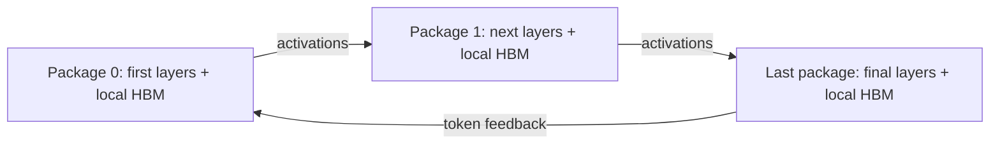

# Static multi-package inference

One decoder spans identical packages using static, contiguous layer stages.
Prefill and decode use the same stages. Each stage owns its weights and
KV/recurrent state in local HBM. Stage boundaries transfer activations; after
prefill and each nonfinal decode step, a token ID returns to the first stage.
This is one distributed model instance, not PD disaggregation or replicas.

Analytic, Packet and CHIPSIM/Garnet refine **intra-package** execution; all three
share an **analytical inter-package fabric**. Cross-package traffic never enters
the local packet/Garnet network. This extends the serving path, not the scope of
Garnet's protocol accuracy.

## Communication model

The `alpha_beta` factory implements the Hockney form:

`T = queue_wait + alpha + message_bytes / effective_bandwidth`.

The [Cornell communication-model notes](https://www.cs.cornell.edu/courses/cs5220/2020fa/lec/2020-10-06-intro.html)
describe this form. [LogGP](https://www.cs.ucsb.edu/research/tech-reports/1995-09)
provides related motivation for distinguishing startup and long-message
bandwidth. This implementation is not the full LogGP model.

The fabric is an ideal nonblocking switch with one FIFO Tx and Rx port per
package. Messages sharing a sender or receiver serialize; opposite directions
and disjoint endpoints overlap. Each message holds its ports during startup and
serialization. Endpoints reserve HYDRA HBM bandwidth and destination memory
until completion. Effective bandwidth is the minimum of configured fabric
bandwidth times efficiency, admitted HBM bandwidth, and the local NoI bandwidth
ceiling. Gateway traversal is folded into this effective model; it does not
reserve individual NoI links or simulate gateway packet queues.

| Parameter | Default | Interpretation |
|---|---:|---|
| `count` | 1 | Identical packages; 1 preserves the existing execution path |
| `bandwidth_gbps` | 25 | Decimal **GB/s**, per package, per direction, before efficiency |
| `efficiency` | 0.8 | Assumed useful-payload fraction |
| `latency_ns` | 1000 | Assumed end-to-end startup including effective gateway overhead |
| `token_bytes` | 4 | Feedback bytes per request per nonfinal inference iteration |

The bandwidth default is an illustrative single-NVLink-4-link-scale budget.
NVIDIA documents **18 links and 900 GB/s aggregate bidirectional bandwidth**
for H100, implying 25 GB/s per link per direction under a symmetric split:
[official Hopper tuning guide](https://docs.nvidia.com/cuda/hopper-tuning-guide/index.html).
The 1 us startup and 80% efficiency are assumptions, not measured NVLink values.
HYDRA packages are not H100s; this budget does not claim NVLink protocol, PHY,
switch or full-device equivalence. Use measured message-size latency/bandwidth
data to calibrate another platform.

Completion is rounded up to HYDRA's **1 us** time resolution. A 4-byte feedback
at the defaults takes 2 us. Requests in a batch send separate messages, following
HYDRA's existing transfer loop; message coalescing is not modeled.

## Placement and extension

`arch_config` and `placmt_config` describe **one package**. `PackageSystem`
replicates its placed mesh with global ID offsets. The NoI graph has disconnected
components; a separate fabric connects their effective endpoints.
`system_snapshot.json` records global chiplets, local links, layer owners and
fabric parameters. `placement.json` remains the single-package template.

`BasePackagePartition` selects `ContiguousPackagePartition` through a factory.
It balances **layer counts**, not compute cost. `PackageMemorySystem` plans
whole-layer placement on local HBMs before committing allocations.
`PackageStaticMapper` subclasses the original mapper and restricts compute to
the owning package. Communication models extend `BasePackageNetwork`.
The Packet C++ engine retains a rectangular queue allocation; Python rejects
cross-package submissions, so XY routes cannot use inactive seam queues.
Garnet receives the disconnected local-mesh topology directly.

Whole layers must fit on individual HBMs. DeepSeek-V3's 623.22 GiB of surrogate
weights fit on four copies of the archived 256-GiB package, with 16/15/15/15
layers per stage. Three packages have enough aggregate bytes but fail this
placement: a 16-GiB HBM cannot hold two approximately 10.72-GiB MoE layers.
Capacity is checked per HBM and per package.

Static batches and static pipeline mapping are supported. Existing independent
request workers can overlap stages; no new microbatch scheduler is introduced.
Tensor/expert parallelism, remote weights/KV, PD state migration, switch
oversubscription, protocol congestion and fabric power/area are outside this
version. Reported area scales the existing package proxy and excludes fabric
switches/PHY.

[Validation results and commands](../../tests/validation/multi_package/README.md)
cover regression, three-backend smoke, sensitivity, capacity and a complete-length
DeepSeek Chat request.

The [package-count and bandwidth study](../../tests/validation/multi_package/study/README.md)
adds a concurrent request burst, source-controlled comparisons, figures and
the subsequent implementation review.
