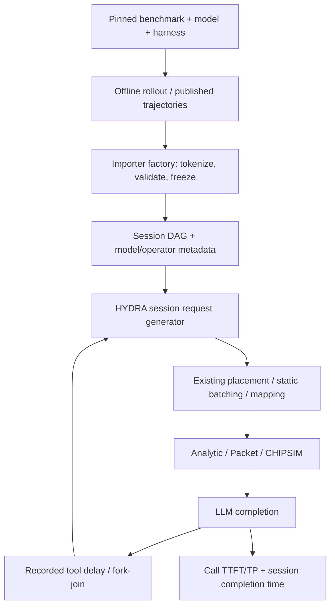

# Modern models and agentic workloads in HYDRA

Research snapshot: **2026-10-03**. The inventory and roadmap below describe the
pre-implementation baseline. Update: experimental Qwen3-8B and Qwen3.5-9B text
**decoder-stack** models are now implemented; see their
[execution contract and validation commands](../../tests/validation/modern_models/README.md).
Modern blocks use explicit GQA/GDN profiles and versioned memory accounting;
legacy models retain the issues identified below. Update **2026-10-04**:
experimental [KDA / MLA operator graphs and a serving fixture](operators/README.md)
now cover dependencies, state versions and memory accounting. A subsequent
[Kimi Linear decoder baseline](kimi/README.md) adds chunked/tiled KDA and colocated
MoE with synthetic routes, validated on all three backends. The next
[streaming MLA and complete-length Chat replay](../../tests/validation/kimi_models/streaming/README.md)
adds bounded SRAM tiling and quantifies network/clock limitations. The
[DeepSeek-V3 decoder baseline](deepseek/README.md) now adds grouped MoE and
[longer existing-dataset replays](../../tests/validation/deepseek_models/README.md).
Distributed experts and DSA remain pending. The initial
[BFCL result-log importer and causal session replay](../agent_workloads/README.md)
are now implemented with synthetic three-backend validation and a
[real archived Qwen3-8B replay](../../tests/validation/agent_workloads/real_bfcl/README.md).
The research roadmap below retains its original
ordering and should be read alongside these implementation updates.
The current backend evidence is in the
[three-fidelity validation report](../../tests/validation/packet_validation/README.md).

## Recommendation

HYDRA can support these workloads while retaining control of hardware, mapping,
runtime, and the three network backends. Two extensions are needed: an explicit
model operator/state description, and a session workload that releases LLM
requests according to tool and turn dependencies. Changing model names or
converting a benchmark directly into independent token-length rows is insufficient.

Start with **Qwen3-8B as a dense reference, Qwen3.5-9B's text branch as a new
hybrid**. Defer BFCL multi-turn traces until the model work is ready. Qwen3.5-9B isolates Gated DeltaNet and
gated attention without also requiring expert routing. Then add a modest MoE
such as Qwen3.5-35B-A3B or Qwen3-30B-A3B. Kimi Linear is the next useful hybrid
target; Kimi K2.6 and DeepSeek-V3.2 reuse much of the subsequent MLA/MoE work.
The newest frontier architectures belong in the design roadmap, with their
additional operators and capacity requirements represented explicitly.

Use recorded trajectories for performance replay first. Generate trajectories
once outside HYDRA, then reuse the same requests, dependencies, and tool delays
across backends and hardware points. Static batching and static offline mapping
remain sufficient for this first stage. Dynamic request release does not require
elastic hardware mapping.

## Baseline repository audit

The following observations describe the pre-implementation local code, not model
papers. For implemented improvements, see the Qwen execution contract linked
above and the [KDA/MLA audit](operators/README.md).

| Area | Current representation | Consequence for extensions |
|---|---|---|
| Model factory | `BaseModelConfig.create_from_name`, dataclass subclasses, `hybrid_blocks`, `block_type_sequence` | Good extension point for ordered heterogeneous layers; older registry entries do not necessarily provide a runnable block sequence |
| Operators | Named `MHA`, `SSM`, `FC`, normalization, activation, convolution kernels through `BaseAccModel` | No native MLA, GDN, KDA, sparse indexer, expert router, or expert collective |
| State | `block.states_store`: fixed size or proportional to context | Cannot describe separate KV, recurrent state, shared cross-layer cache, and prefix ownership |
| Execution | Sequential `ExecutionPhase(compute_ns, memory_bytes)`; aggregate HBM traffic | Adequate for existing local kernel phases; MoE dispatch/combine and multiple remote dependencies need richer transfer phases |
| Placement | Block weights and static task mapping; several paths classify blocks by `mamba` / `transformer` substrings | Replace name-based classification with explicit operator capabilities before adding new block families |
| Workload | Token-length CSV; fixed interarrival time; first N rows | No conversation identity, tool timing, branching, fork/join, or user think time |
| Request | One prefill and a prescribed number of decode iterations | No completion-to-next-turn dependency or retained session state |
| Precision | Global bytes-per-parameter; packet adapters currently require one byte | Modern mixed weight/activation/KV/state precision cannot be inferred from one scalar |

Relevant code: [model configurations](../../Sim/config/model_config.py),
[request generator](../../Sim/request_generator/trace_request_generator.py),
[request](../../Sim/entities/request.py), [block](../../Sim/entities/block.py),
[profiles](../../Sim/execution/native.py), and
[execution phases](../../Sim/entities/execution.py).
The [static mapper](../../Sim/entities/static_mapper.py) and
[bandwidth placer](../../Sim/placer/bw_placer.py) also need this capability
generalization; implementing a model config and profile alone will not suffice.

### Existing data audit

The [CSV inventory](dataset_inventory.json) records counts and raw length
distributions for all 13 local CSVs. Selected examples:

| Dataset/file family | Rows per file | Median input/output tokens | Raw input/output p95 |
|---|---:|---:|---:|
| Chat | 19,975 | 23 / 154 | 369 / 516 |
| arXiv | 28,257 | 2,730 / 167 | 3,813 / 736 |
| BWB | 195,522 | 3,281 / 2,192 | 5,111 / 3,458 |
| LongWriter, Nemo | 6,000 | 97 / 6,752 | 1,478 / 17,140 |

Within Chat, arXiv, and BWB, the LLaMA/Mamba/Nemo files are respectively
byte-identical. Model-specific filenames therefore do not establish
model-specific tokenization. Chat also contains a raw decode length of 492,199;
its provenance should be checked before treating the tail as representative.
The table describes stored lengths before runtime scaling/clipping. None of
these files establishes agent sessions or tool dependencies.

Preserve these datasets as regression controls. Their main limitation for this
task is missing interaction structure and provenance, not their age alone.

### Correctness work required before modern-model claims

The review fixed double application of `prefill_scale_factor` and added a
regression for prefill, decode, and end-to-end modes. Scale=1 comparisons are
unchanged. The following shared legacy assumptions remain and must be resolved
in a separately versioned model/runtime baseline:

1. `Request.fill_request()` constructs prefill blocks without `is_prefill=True`.
   `block` consequently uses one-token intermediate/output sizing even though
   compute profiling uses the prompt length. This affects memory/transfer
   interpretation and needs an end-to-end memory accounting test.
2. `block.context_length` clamps to the model limit, while state sizing uses the
   original argument. The trace loader's independent `max_tokens` limit can
   exceed the model limit. Reject incompatible lengths or explicitly implement
   sliding/truncation semantics; never silently combine these two lengths.
3. The pipeline admission calculation in `Sim/processing.py` subtracts
   `pre_states_cache.size` (MiB) from `states_store` (parameter/state elements).
   Introduce unit-consistent state deltas and test both constant recurrent
   state and growing KV state under capacity pressure.
4. Existing attention profiles use approximations such as `d_k=D/kv_heads` and
   full-width QKV traffic. Audit explicit `head_dim`, GQA projections, gated
   MLP projections, embedding/LM-head costs, and MAC-versus-FLOP conventions.
   A new config alone does not make an old profile accurate for Qwen or MLA.
5. Native transfer units/rounding differ from the network-refined execution
   contract. See the validation report's review findings. Three backends sharing
   an approximation cannot independently validate that approximation.

These are explicit limitations of the current baseline, not evidence that the
new network transport loses packets. Keep the existing recorded comparisons
as the legacy baseline; refresh all affected curves after changing shared
memory or operator semantics.

## Model landscape and implementation cost

“Hybrid” covers several independent choices: token mixing (full, recurrent,
sparse, compressed attention), dense versus expert FFNs, residual/state sharing,
and modality. Represent these dimensions compositionally instead of assigning
every non-Transformer block to the Mamba category.

The [model inventory](model_inventory.json) contains official config snapshots,
resolved revisions, source URLs, and SHA-256 hashes for 12 checkpoints. Only
metadata was downloaded; no weights or remote model code were executed.
The table selects useful architectural representatives rather than ranking
models by benchmark scores. Implementation cost is a HYDRA engineering estimate.

| Candidate | Verified architectural facts | HYDRA additions | Priority / cost |
|---|---|---|---|
| Qwen3-8B | Dense GQA; 36 layers, 32 Q / 8 KV heads, head dimension 128 | Correct GQA/gated-MLP shapes, QK norm and tokenizer/template; reference operator tests | First reference / small after shared audits. [Config](https://huggingface.co/Qwen/Qwen3-8B/blob/main/config.json) |
| Qwen3-30B-A3B | 48 layers; 128 routed experts, 8 selected per token | Router, expert weight residency, token-to-expert assignment and dispatch/combine | First isolated MoE / substantial. [Config](https://huggingface.co/Qwen/Qwen3-30B-A3B/blob/main/config.json) |
| Qwen3.5-9B, text branch | 32 layers: 24 GDN and 8 gated-attention layers; dense FFN | GDN prefill/decode profiles, recurrent state, gated GQA; explicitly exclude vision processing in text-only runs | First modern hybrid / medium. [Model card](https://huggingface.co/Qwen/Qwen3.5-9B) |
| Qwen3.5-35B-A3B, text branch | 40 layers; 256 experts, top-8; hybrid linear/full attention | Compose GDN with MoE and shared expert; text-only scope | Second hybrid / substantial. [Config](https://huggingface.co/Qwen/Qwen3.5-35B-A3B/blob/main/config.json) |
| Qwen3-Next-80B-A3B | Full attention every fourth layer; 48 layers, 512 experts, top-10 | Same operator families, different dimensions and routing; larger resident weights | Useful comparison after smaller models. [Config](https://huggingface.co/Qwen/Qwen3-Next-80B-A3B-Instruct/blob/main/config.json) |
| Kimi Linear 48B-A3B | KDA plus global MLA; config specifies 20 KDA and 7 full-attention layers; 256 experts, top-8, one shared expert | KDA-specific gates, layout-aware MLA cache, MoE; preserve exact layer list, including final MLA layer | [Initial decoder baseline](kimi/README.md) available with synthetic routes and colocated experts. [Repository](https://github.com/MoonshotAI/Kimi-Linear), [config](https://huggingface.co/moonshotai/Kimi-Linear-48B-A3B-Instruct/blob/main/config.json) |
| DeepSeek-V3.2 | MLA/MoE backbone with DeepSeek Sparse Attention; 61 layers, 256 routed experts, top-8 | MLA implementation choice, indexer/top-k selection, sparse gathers, expert communication | After MLA/MoE / large. [Model card](https://huggingface.co/deepseek-ai/DeepSeek-V3.2), [report](https://arxiv.org/abs/2512.02556) |
| Kimi K2.6 | Text config uses MLA and MoE: 61 layers, 384 routed experts, top-8; multimodal checkpoint | Reuse MLA/MoE; separate text-only path and vision costs; realistic capacity planning | Large-scale validation / large. [Official checkpoint](https://huggingface.co/moonshotai/Kimi-K2.6) |
| DeepSeek-V4-Flash | 284B total / 13B active; CSA/HCA hybrid compressed attention, mHC; mixed expert precision | Compression/indexing/window buffers, residual mixing, quantization metadata | Frontier target / very large. [Official model card](https://huggingface.co/deepseek-ai/DeepSeek-V4-Flash) |
| DeepSeek-V4.1-Flash | Causal encoder-decoder, CSA2 with cross-layer cache/index reuse, Engram conditional memory; different prefill/decode active work | Phase-dependent operator graphs, shared cache ownership, lookups/offload, replay and speculative state semantics | Research extension / very large. [Official model card](https://huggingface.co/deepseek-ai/DeepSeek-V4.1-Flash) |
| Qwen3.8-Flash-Next | GDN + QSA; four-branch gated residual; 125B main model plus 51B n-gram embeddings, 6B active | Sparse indexer, residual branches, host-memory lookup/prefetch and transfer modeling | Frontier target / very large. [Official repository](https://github.com/QwenLM/Qwen3.8-Flash-Next) |
| Kimi K3 | 69 KDA + 24 gated MLA layers; Attention Residuals and latent MoE; 896 experts, top-16 | Reuse KDA/MLA, then latent expert projections, residual data dependencies and mixed precision | Frontier target / very large. [Official repository](https://github.com/MoonshotAI/Kimi-K3) |

Kimi K2/K2.5 and DeepSeek V3/R1 remain useful intermediate references. Do not
equate K2's MLA/MoE architecture with Kimi Linear's recurrent hybrid, or a
DeepSeek-R1 distilled Qwen checkpoint with the full DeepSeek architecture.
Record the exact checkpoint and base architecture for each experiment.

### Operator and state modeling requirements

**GQA / gated attention.** Use explicit Q/K/V head counts and head dimensions.
For a conventional equal K/V head dimension, cached state per sequence/layer
is `2 * context_tokens * kv_heads * head_dim * kv_bytes`, plus layout overhead.
Hidden dimension divided by KV-head count is generally not the head dimension.
Gate, projection, normalization and softmax costs belong in the shared profile.

**GDN / KDA.** Both use recurrent matrix state, but their gates and kernels are
different. Provide separate classes and separate prefill/decode algorithms.
Prefill commonly processes chunks with extra temporary storage; decode updates
recurrent state. An existing SSM kernel is not a valid substitute. GPU kernel
timings can check scaling and operation counts, but cannot directly calibrate
TSCS/MARCA latency without a mapping to those accelerators.

A capacity illustration derived from the Qwen3.5-9B config: assuming FP32 state,
32 value heads with 128-by-128 state require **2 MiB per recurrent layer per
sequence**, or 48 MiB over 24 layers, excluding convolution and scratch state.
Its eight full-attention layers with four 256-wide KV heads require **32 KiB
per context token** at BF16 KV precision, or 2 GiB at 65,536 tokens. These are
layout/precision assumptions for planning, not measured HYDRA results. They show
why fixed recurrent state and growing KV state need separate accounting.

**MLA.** Choose and document compressed-cache/weight-absorption behavior. A
common compressed representation stores latent KV and the positional key,
approximately `(kv_rank + positional_key_dim) * kv_bytes` per token/layer;
materializing expanded K/V changes memory traffic and compute substantially.
NoPE variants need their own cache specification. DSA additionally needs index
keys, query scoring, selection, gathers, and sparse attention. “Attend to K
tokens” does not remove indexer or cache-write cost.

**MoE.** Store all resident experts, while charging compute to selected experts.
An A3B model cannot be allocated as a dense 3B-weight model. Distinguish per-token
active experts from the union touched by a batch. Model token permutation,
dispatch, expert GEMMs, shared experts, combine, skew, and capacity/overflow
policy. Route weights can come from a frozen real routing trace or a declared
seeded distribution; lengths alone cannot predict them. Static expert placement
is compatible with dynamic per-token expert selection. Elastic remapping is
unnecessary initially.

For network validation, lower dispatch/combine into flows with explicit source,
destination, bytes, and dependencies. A scalar “all-to-all latency” would hide
the mechanism medium/high fidelity are meant to examine. Do not tune routing
or buffer parameters until serving curves happen to match.

**Compressed/sparse/residual/multimodal extensions.** Newer frontier models
require operators beyond MLA and GDN. The operator graph must represent
cross-layer reuse, lookup/prefetch, fork/join, and phase-specific execution.
Text-only experiments can defer the vision encoder; image/video agents cannot.
Speculative decoding requires draft/verification work, accepted/rejected tokens,
and recurrent-state rollback. Disable it explicitly for the first baseline;
do not charge only accepted tokens while assuming its speedup.

## Agentic benchmark landscape

Task definitions, execution trajectories, and production arrival traces solve
different problems. A task benchmark provides goals and evaluators; a trajectory
provides the actual sequence of model/tool work; a serving trace may provide
timing and cache metadata without enough text to retokenize for another model.

| Source | What is available / relevant | HYDRA fit and preparation |
|---|---|---|
| **BFCL V3/V4** | Multi-turn/multi-step evaluation plus V4 web-search and memory categories | Best controlled first importer. Generate or obtain inference logs; preserve tool schemas, failures, and steps. [README](https://github.com/ShishirPatil/gorilla/blob/main/berkeley-function-call-leaderboard/README.md), [categories](https://github.com/ShishirPatil/gorilla/blob/main/berkeley-function-call-leaderboard/TEST_CATEGORIES.md) |
| **tau-bench / tau2-bench** | Stateful customer-service tasks with user/agent/tool interaction | Good second workload for session state and external delays. Pin a text-only release/domain; separate user-simulator LLM traffic from agent traffic. [tau-bench](https://github.com/sierra-research/tau-bench), [tau2 repository](https://github.com/sierra-research/tau2-bench) |
| **tau3 additions in the tau2 repository** | Current main includes knowledge retrieval and voice/full-duplex support, task fixes and changed dependencies | Knowledge/text domains are relevant later. Voice needs a different model/arrival contract. Do not silently compare updated task scores with older ones. [Release notes](https://github.com/sierra-research/tau2-bench/blob/main/RELEASE_NOTES.md) |
| **Toolathlon-Verified** | Diverse real application tools; published multi-model trajectories | Strong option to avoid an expensive first live collection. Audit logs for tool durations, tokenization and model identity; missing timing requires instrumentation or declared assumptions. [Repository](https://github.com/hkust-nlp/Toolathlon), [trajectories](https://huggingface.co/datasets/hkust-nlp/Toolathlon-Verified_Trajectories) |
| **MCPMark** | Stateful tasks across MCP services | Useful tool/schema and long-horizon stress. Pin service versions, freeze observations, and record external service delay separately. [Repository](https://github.com/eval-sys/mcpmark) |
| **Terminal-Bench / SWE-bench** | Executable terminal tasks / repository issue tasks and evaluators | Representative coding-agent context growth. Need actual agent trajectories plus terminal/test/tool duration; a task record alone is insufficient. [Terminal-Bench 2](https://github.com/harbor-framework/terminal-bench-2), [SWE-bench](https://github.com/SWE-bench/SWE-bench) |
| **AgentX harness** | Public multi-turn long-context trace replay harness based on AIPerf | Promising performance-oriented complement to BFCL. Inspect dataset access/schema, per-turn dependencies, cache identifiers and licensing before making it a required artifact dependency. [Harness](https://github.com/SemiAnalysisAI/agentx-harness) |
| **ToolSandbox** | Stateful tools and conversational evaluation | Useful small correctness cases for state transitions and dependency ordering. [Repository](https://github.com/apple-aiml-research/ToolSandbox) |
| **ToolBench / StableToolBench** | Broad API tool tasks; ToolBench links the stabilized evaluation effort | Good breadth, but live API variability and emulated-tool semantics need careful provenance. Lower priority than controlled BFCL replay. [ToolBench](https://github.com/OpenBMB/ToolBench) |
| **AgentBench** | Multiple agent environments | Useful diversity, but environment integration is substantial and the original benchmark is older; not the first serving workload. [Repository](https://github.com/THUDM/AgentBench) |
| **LongBench v2 / RULER** | Long-context tasks / controlled context-length stress | Useful complements for sparse/recurrent attention; neither establishes a tool-use session by itself. [LongBench](https://github.com/THUDM/LongBench), [RULER](https://github.com/NVIDIA/RULER) |

Recent systems research provides useful methodology: XPerf describes fine-grained
agent trace replay; AgentSysBench studies heterogeneous non-LLM components and
stateful sessions; AgentPerfBench targets agent inference performance. Treat
these papers as design references until their code/data availability is verified
for the intended artifact. The XPerf abstract currently says code will be
released. [XPerf](https://arxiv.org/abs/2608.20370),
[AgentSysBench](https://arxiv.org/abs/2608.15127),
[AgentPerfBench](https://arxiv.org/abs/2609.34683).

The Harvard MadSys data catalog distinguishes released Chutes request metadata
from **planned** FreeInference agent-serving and raw-prompt datasets. The latter
should remain a watchlist item, not a claimed downloadable prerequisite.
[Catalog and release status](https://data.agentic-system.org/).

### BFCL: concrete feasibility check

We inspected the actual `BFCL_v4_multi_turn_base.json` at pinned Gorilla revision
`6ea57973c7a6097fd7c5915698c54c17c5b1b6c8`: 200 entries, 1–7 user-question turns
per entry, with task IDs, questions, initial environment configuration, paths,
involved classes, and excluded functions. There are no top-level token counts
or timing fields. The [schema audit](bfcl_schema_audit.json) records the source
URL, hash, and observed schema. User turns are not LLM-call counts: one turn can
contain multiple model/tool steps.

The official log format can include transformed inference inputs, raw assistant
responses, separate tool responses, state snapshots, and handler failures.
`--include-input-log` is therefore useful during collection. Ground-truth
conversation visualization can help importer tests, but should not be presented
as a model's measured rollout. [BFCL log guide](https://github.com/ShishirPatil/gorilla/blob/main/berkeley-function-call-leaderboard/LOG_GUIDE.md).

Recommended subset: `multi_turn_base` first, then `multi_turn_long_context`,
missing-function/parameter cases, and V4 memory. Add web search after response
snapshots and timing are reproducible. The 2025 web-search blog describes
DuckDuckGo, while the inspected current README configures SerpAPI: pin the
implementation rather than assuming the historical backend is still used.
[V3 behavior](https://gorilla.cs.berkeley.edu/blogs/13_bfcl_v3_multi_turn.html),
[V4 search](https://gorilla.cs.berkeley.edu/blogs/15_bfcl_v4_web_search.html),
[V4 memory](https://gorilla.cs.berkeley.edu/blogs/16_bfcl_v4_memory.html).

Preparation sequence for a future implementation:

1. Freeze the Gorilla revision, category, task IDs, model/tokenizer revisions,
   handler, chat template, sampling settings, reasoning mode and step limits.
   Use the official `bfcl-eval` package in a separate collection environment.
2. Obtain existing rollouts or generate a small stratified subset with input
   logging. Verify CLI/model-handler support against the pinned checkout.
3. Instrument each model invocation and tool span. Record raw prompt/output or
   token IDs, usage counters, tool IDs, dependencies, tool duration and outcome.
   Existing BFCL logs are useful but do not guarantee all timing fields.
4. Convert to an immutable session trace, checking that every generated turn is
   represented. Preserve failed calls, retries and budget exits; do not keep only
   successful/short tasks. Run BFCL's evaluator separately and attach its result.
5. Replay identical traces through all network backends. Report inference TP/TTFT
   separately from agent completion time and task success.

No model API calls or benchmark task executions were performed for this report.

## Proposed HYDRA implementation

### Keep the current factories and ownership

The following classes are proposals. Implement them as subclasses with the
existing `get_name()` / `create_from_name()` convention, not a parallel registry
of ad hoc functions or a large model-name switch in `processing.py`.

| Extension | Proposed responsibility | Existing integration point |
|---|---|---|
| `BaseModelImporter` → `HuggingFaceConfigImporter` | Validate a pinned config and build explicit layer/operator/state definitions | `Sim/config/model_config.py`, `BaseFixedConfig` |
| Attention/FFN/state configuration subclasses | Compose GQA, MLA, GDN, KDA, dense/MoE FFNs, KV and recurrent states | Existing `BaseBlockConfig` and ordered block sequence |
| Accelerator profile subclasses/capabilities | Profile each supported operator, reject unsupported hardware mappings | `analytic_profile/Base_Accmodel.py` and execution factory |
| `BaseExpertRouting` / `BaseExpertPlacement` | Seeded or trace-driven token routes; static expert placement | Existing static mapper and placer factory; introduce a mapper base/factory as needed, keeping placement separate from route selection |
| `BaseWorkloadImporter` → `BFCLTraceImporter`, `ToolathlonTraceImporter` | Normalize external logs and retain provenance | New offline importer package; no external benchmark dependency in the simulator loop |
| `SessionRequestGenerator` | Release ordinary HYDRA requests once parent steps complete | Request-generator interface and SimPy completion events |
| `BaseToolLatencyModel` → recorded/fixed/distribution variants | Schedule external delay or capacity-limited tool work | Session dependency graph |
| `BaseSessionStatePolicy` → no-reuse/resident-prefix variants | Allocate/retain/evict KV and recurrent checkpoints across turns | Memory system and request lifecycle |
| `AgentMetricsRecorder` | Per-call, per-turn and per-session metrics | Existing serving recorder, with explicit event definitions |

Preserve a simple adapter for existing independent CSV requests. A first session
backend can retain static batches among currently ready calls. Specify a bounded
wait or partial-batch policy so a session whose next call depends on completion
does not deadlock waiting for a full batch.



### Trace contract

Use versioned JSONL or an equivalent typed format. A minimal illustrative
session fragment, with synthetic numbers, is:

```json
{"schema_version":1,"session_id":"s0","node_id":"llm0","kind":"llm","parents":[],"arrival_us":0,"model_id":"pinned-model","prompt_tokens":2048,"generated_tokens":96,"prefix_id":null}
{"schema_version":1,"session_id":"s0","node_id":"tool0","kind":"tool","parents":["llm0"],"duration_us":200000,"duration_source":"scenario","tool_call_id":"c0"}
{"schema_version":1,"session_id":"s0","node_id":"llm1","kind":"llm","parents":["tool0"],"model_id":"pinned-model","prompt_tokens":2600,"generated_tokens":160,"prefix_id":"s0-prefix0","reusable_prefix_tokens":2144}
```

Store sampling seed, source task/model/harness revisions, tokenizer/template
hashes, truncation policy, token-count provenance and outcomes in the manifest.
In a full schema, distinguish generated reasoning, tool-call and visible-answer
tokens; generated work includes all three. Tool call arguments and schemas are
tokens too. Prefix IDs require token/block identity, not just matching lengths.
`reusable_prefix_tokens` describes an available match, not a guaranteed cache hit.

For replay, a dependent call becomes ready at the **simulated** completion of
its parents plus recorded external delay. Do not reuse original wall-clock
request start times for dependent turns: that would disconnect hardware speed
from future arrivals. Independent session arrival times can be replayed as an
open-loop trace. Closed-loop clients instead release the next session after
completion plus think time; label the chosen load model.

For parallel tools, preserve whether the harness actually executed concurrently.
Join on all required results; their delay is a maximum only when independent
resources and unconstrained concurrency justify it. Internal LLM calls made by
a tool must become LLM nodes if their compute is within the simulated system.
Remote service delay is not NoI traffic unless the hardware boundary explicitly
includes that service.

### Cache and metric semantics

The simplest defensible baseline is **full re-prefill, no cross-turn cache
reuse**, labelled explicitly. It validates causal session replay but cannot
support claims about prefix-caching benefits. Next add resident session state:
attend to the full logical context while computing only the uncached suffix;
retain memory across tool waits; model eviction/recomputation/offload. Recurrent
state reuse needs snapshots at matching prefixes, and cannot be modeled as
arbitrary KV block slicing. Context edits, compaction, branching and template
changes can invalidate cached state.

For an LLM call record queue delay, prefill time, first-token time, decode time
and completion time. Record session JCT from session arrival to final answer,
including external delays, plus LLM calls/session, tools/session, peak resident
state and completed/failed/censored sessions. Use generated-token TP for compute
load; useful final-answer TP is a separate metric. Reasoning-first TTFT and
first-visible-answer latency differ. Current HYDRA's shared TTFT convention
also requires an explicit queue/prefill/first-decode audit before calling it
client-observed TTFT.

Model quality remains an external benchmark result. HYDRA predicts timing for
the supplied trajectory; it cannot decide whether a tool call is correct or
whether a faster design changes the agent's decisions. A trajectory from model A
retokenized for model B is a controlled counterfactual workload, not a measured
model-B behavior trace. Keep both same-trace architectural comparisons and
native-model rollouts, clearly labelled.

## Implementation stages and preparation

These are engineering stages, not a new exhaustive DSE requirement.

| Stage | Deliverable | Preparation and exit condition |
|---|---|---|
| 0: model correctness | Unit-consistent memory/state accounting, explicit lengths/head dimensions/precision | Version modern memory semantics; retain archived legacy baselines; hand-check operator and memory examples |
| 1: modern dense | Qwen3-8B decoder control (initial implementation available) | Shape/phase checks and equal inputs across three backends; compute calibration and full-model scope remain follow-ups |
| 2: modern hybrid | Qwen3.5-9B text decoder (initial implementation available) | GDN/KV bytes and capability mapping; calibrate chunked-prefill/decode timing and compare context lengths before serving claims |
| 3: MoE | Qwen3-30B-A3B or Qwen3.5-35B-A3B | Expert placement and routing provenance; dispatch/combine conservation; load-skew and capacity tests; retain static mapping |
| 4: Kimi / DeepSeek | Kimi Linear, then MLA/MoE large models and DSA | KDA/MLA profiles, memory-capacity sizing and routing traces; small mechanism tests in CHIPSIM before full serving |
| 5: agent sessions (deferred) | BFCL importer and causal replay without cache reuse; then a second benchmark | Pinned tokenizer/template and frozen rollouts; tool-delay provenance; sequential/parallel dependency tests |
| 6: advanced serving/frontier | Cache reuse/offload, sparse/compressed attention, residual sharing, multimodality or speculation | Add only mechanisms needed for the next research question; frontier config support alone does not satisfy this stage |

Stages 0–2 are moderate development efforts; MoE network lowering and cache
lifecycle work are larger; full frontier models are separate research projects.
Exact calendar estimates need the accelerator operator mapping and available
trace/profiling resources. No full model weights are needed for analytical
simulation itself. Weights/GPU access or a hosted endpoint are needed only if
collecting new rollouts, inspecting expert routes, or measuring reference kernels.
Large-model API rollouts will generally not expose internal routing traces.

For model implementation, prepare a small model manifest, an operator support
matrix for each accelerator and explicit precision/layout assumptions. For the
later session work, also prepare frozen trajectories with provenance, a tool-delay
policy and a cache policy. Retain
source licenses and dataset redistribution conditions with downloaded artifacts;
model-code, weights, and benchmark-data licenses are separate. Existing public
trajectories are the cheapest starting point when they contain the needed fields.

For validation, first hand-check one layer and one session, then 16–32 stratified
sessions spanning short/long contexts, few/many steps, success/failure, and
sequential/parallel tools. Compare a few capacity-feasible design points. Use
multiple arrival seeds and paired session-level confidence intervals only once
there are enough independent sessions; repeated deterministic simulations measure
implementation reproducibility, not workload uncertainty. Report p50/p95 latency,
coverage, timeouts and wall time. Keep high-fidelity checks focused on selected
communication-sensitive points and retain stress-test counterexamples.

The current implementation covers **versioned model/state accounting,
one modern dense control and one GDN hybrid**, plus experimental
[KDA/MLA operator graphs](operators/README.md) and a
[Kimi Linear decoder baseline](kimi/README.md). Calibration and complete subsequent
model families come before BFCL/session integration. The latest Kimi/DeepSeek/Qwen
architectures inform these interfaces without requiring every frontier feature
before the first useful TP–TTFT comparisons.
