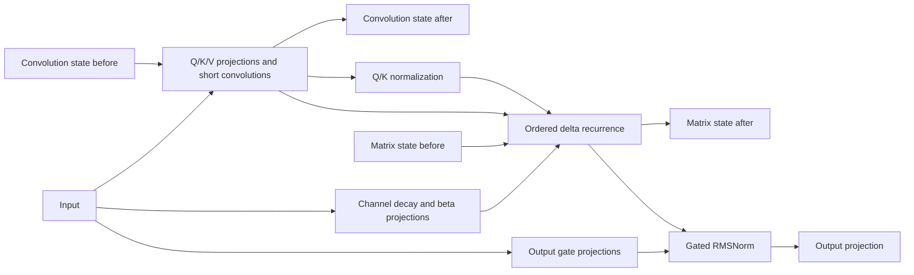

# KDA and MLA operator support

Implementation and audit snapshot: **2026-10-04**. HYDRA now has experimental
KDA and MLA **performance models** with tensor dependencies, state versions,
memory estimates and directed execution phases. They do not execute numerical
tensors or constitute complete Kimi/DeepSeek models. Reproduction commands and
recorded results are in the [operator validation README](../../../tests/validation/operator_validation/README.md).

Subsequent implementation: [KDA chunk/tile scheduling, colocated MoE and the
Kimi Linear decoder baseline](../kimi/README.md) are now available. The original
operator fixture/results remain archived below; they are not overwritten by
the decoder validation.

## What needed changing

| Existing representation | Problem for these operators | Change in this implementation |
|---|---|---|
| Flat `OperatorWork` records with one working-set size | Cannot track branches, last consumers or separate transient and persistent storage | `TensorSpec`, `OperatorNode`, `OperatorGraph`; validated producer/consumer edges and deterministic topological order |
| `ExecutionPhase(compute_ns, memory_bytes)` | Overlaps a dependent read with its consumer and has no write direction | Optional ordered read → compute → write phases, including repeated recurrence steps; legacy overlap retained |
| Fixed state or context-linear state scalar | KDA has matrix and convolution state; MLA cache layout changes compute as well as bytes | Explicit state tensor versions and layout-specific graph construction |
| `peak_intermed * tokens` | Misses materialized MLA's quadratic prefill workspace | Version 3 block memory accounting uses graph liveness and workspace in admission |
| Static admission assumes every HBM holds weights | Small fixtures crash on unused HBM | Empty-HBM handling in scheduler and memory lookup |
| Substring block lookup and unchecked outer `zip` | `Block 1` can match `Block 10`; missing layer groups can silently disappear | Exact weight identity and layer-group length validation |

The existing model/profile factories remain the integration points. Configuration
dataclasses live in `Sim/config/attention_operator_config.py`; `KDAProfile` and
`MLAProfile` subclass `GraphOperatorProfile` / `BaseOperatorProfile`. There is no
model-name dispatch in the execution loop. A kernel/configuration/family mismatch
fails explicitly. The two-block `kda-mla-operator-fixture` is registered through
`BaseModelConfig`; it deliberately excludes FFNs, residual blocks and embeddings.

Older GQA/GDN profiles remain version 1 analytical baselines. Their aggregate
working-set/spill accounting and recurrence timing have not been upgraded to
this graph contract. In particular, their working bytes can mix recurrent state
residency with traffic, and convolution-state traffic is grouped with recurrence.
Migrating them needs separate regression/calibration work; the archived figures
are not regenerated by this operator change.

## KDA: gates, recurrence and storage

The [Kimi Linear paper](https://arxiv.org/abs/2510.26692) describes channel-wise
gating and a chunkwise algorithm. The inspected
[Kimi implementation](https://huggingface.co/moonshotai/Kimi-Linear-48B-A3B-Instruct/blob/e1df551a447157d4658b573f9a695d57658590e9/modeling_kimi.py)
selects recurrent execution for sequences of at most 64 tokens and chunk execution
for longer inputs. The original profile selects **recurrent** execution for both
stages. The new `algorithm='chunk'` path supports chunk prefill and tiled recurrent
decode; its triangular-solve schedule is documented in the linked Kimi contract.
Neither analytical implementation is a calibrated model of the optimized FLA kernel.

For batch `B`, heads `H`, head dimension `K` and convolution width `C`, the
implemented contract reserves `4*B*H*K*K + 3*B*H*K*C` state bytes: FP32 matrix
state and A8 convolution history. Decay gates have `H*K` channels, while beta
has `H` values per token. The recurrence counts three matrix/vector MAC groups
per token, following the
[FLA reference recurrence](https://github.com/fla-org/flash-linear-attention/blob/main/fla/ops/kda/naive.py).
Fresh prefill starts with no previous state read; decode reads previous state.
State writeback completes before the next spilled-state update can begin.

Kimi-shaped KDA (`H=32`, `K=128`, `C=4`) needs **2.046875 MiB per sequence per
layer**, independent of context. A 1 MiB SRAM therefore cannot hold the entire
matrix in the original untiled schedule. The new head/value-column schedule can
retain smaller state tiles in SRAM; whole-state spill remains a conservative
legacy baseline, not an optimal mapping.

## MLA: algorithm and cache must agree

The [DeepSeek-V3 report](https://arxiv.org/abs/2412.19437) uses MLA alongside MoE.
The [official inference implementation](https://github.com/deepseek-ai/DeepSeek-V3/blob/main/inference/model.py)
provides expanded and absorbed computation. We model both: expanded attention
projects K/V before caching; absorbed attention transforms the query into latent
space, attends to the latent cache, then expands the value result. The inspected
Kimi reference stores expanded K/V. Its NoPE option disables rotation while
retaining the positional projection channels.

With latent width `C`, key widths `P` and `R`, value width `V`, heads `H`, and
one-byte cache elements:

| Layout | Cache bytes per token per sequence | Matching computation |
|---|---:|---|
| Expanded | `H*(P+R+V)` | KV expansion, QK over `P+R`, AV over `V` |
| Absorbed | `C+R` | Query absorption, QK over `C+R`, AV over `C`, value expansion |

The graph distinguishes old cache from appended entries, writes only the new
entries, and reads each required cache component at its consumer. The default
materialized algorithm allocates `B*H*T*L` scores, including masked entries in dense MAC
counts. Scores and the materialized softmax result use FP32; a separate cast node
produces A8 probabilities. Explicit tensor edges preserve producer-before-read
ordering even when the softmax result spills.
Peak scratch therefore grows quadratically for fresh prefill. This is not a
FlashAttention/streaming model. An opt-in streaming algorithm is now available
with [an explicit SRAM schedule](../kimi/README.md#4-streaming-mla-and-reliability-checks).
Neither path supports DeepSeek-V3.2's sparse indexer.

Recorded single-layer state estimates under this precision contract:

| Operator / dimensions | Context 128 | Context 4096 |
|---|---:|---:|
| Kimi KDA, `H=32,K=128` | 2.047 MiB | 2.047 MiB |
| Kimi expanded MLA, `H=32,P=128,R=64,V=128` | 1.250 MiB | 40.000 MiB |
| DeepSeek absorbed MLA, `C=512,R=64` | 0.070 MiB | 2.250 MiB |

These are state bytes, not total working memory or a like-for-like comparison
of model sizes. The [profile exporter](../../../tests/validation/operator_validation/profile_operators.py)
also records weights, peak activations, traffic and synthetic-rate timing.

## Execution contract and remaining work

Graphs use one compute chiplet per block and serialize a valid topological
schedule. They represent independent branches without scheduling them in
parallel. Weights/state reside in mapped HBM; if peak activation storage exceeds
SRAM, every intermediate spills. Operand reads are conservatively charged per
consumer. There is no tile-level cache replacement, prefetch or persistent
cross-call weight residency. Recurrence repetition is compact metadata, expanded
lazily by the contended network paths. Outer runtime allocation still reserves
one aggregate state footprint per block, without per-component placement.

All three backends consume these shared compute profiles. Ordered phases add
read, compute and write durations; legacy phases retain overlap. Packet/Garnet
also include access/network delay and round each primitive phase to HYDRA's
microsecond clock. Analytic uses aggregate block timing. These differences are
visible for tiny operators. Optional DMA pacing remains source-HBM injection
pacing; directed writes obey local bandwidth timing but do not implement a
destination HBM controller queue. The fixture leaves DMA pacing disabled.

W8/A8/KV8, FP32 matrix state/logits and one-byte gate/norm weights are declared
simulation assumptions, not the checkpoints' native mixed precision. Generic
MAC/element rates do not independently calibrate sigmoid, exp, normalization,
FP32 state arithmetic or quantization overhead. The new chunk graph has numerical
algebra checks against a recurrent oracle; quantized full-model equivalence and
hardware latency calibration remain open.

Further refinements (not required for integration smoke tests):

1. Calibrate and optimize the implemented chunked/tiled KDA schedule, including
   precision-specific rates and comparison with the intended accelerator kernels.
2. Calibrate the new tiled/streaming MLA schedule and its precision-specific costs;
   calibrate prefill and decode separately using measured kernels or RTL data.
3. Extend the colocated MoE baseline with recorded routes, grouped routing and
   distributed expert placement/join scheduling. The implemented baseline already
   accounts for all resident experts, active expert work and staged dispatch/combine.
4. Extend the implemented [DeepSeek-V3 baseline](../deepseek/README.md) to DSA
   and later model families; grouped MoE and V3 decoder composition are now available.
   V3.2 additionally requires DSA index scores, top-k selection,
   index-cache storage and irregular gathered attention. Other Kimi architectures
   must have their own manifests rather than inheriting Kimi Linear operators.

Model shapes/revisions are in the [model inventory](../model_inventory.json).
Inspected source URLs and SHA-256 hashes are in
[source_inventory.json](source_inventory.json); upstream `main` URLs are mutable.
No weights were downloaded and no external model code was executed.
