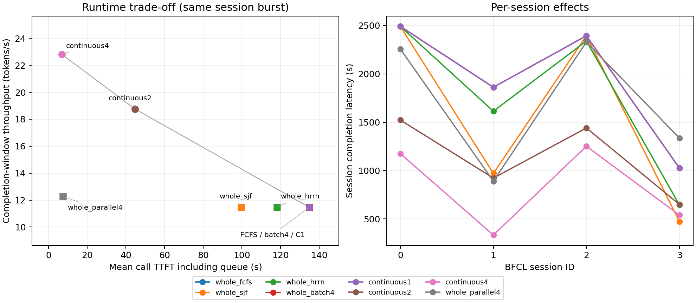

# BFCL runtime trade study

This study holds the model, hardware, complete trajectories and tool assumptions
fixed while changing request priority and batching. It uses Qwen3-8B and the
first four numeric `multi_turn_base` session IDs from the pinned public archive.
The archive hash is checked before selection; no correctness filtering, token
truncation or duplicated sessions are used.

The workload contains **4 sessions, 41 LLM calls, 28,571 generated tokens and
41 executed tools**. Every call has a different prompt length. All sessions
arrive at zero: this is a controlled burst, not measured production arrivals.
Prefix caching and offload are disabled because the archive cannot establish
exact token identities. Recurrent restoration is not used.

## Reproduce

From the repository root with the HYDRA environment active, fetch the pinned
archive if it is not already local:

```bash
python tests/validation/agent_workloads/fetch_bfcl.py \
  --output-dir output_sanity_checks/bfcl_trade_archive

MPLCONFIGDIR=/tmp/hydra-bfcl-mpl python \
  tests/validation/agent_workloads/study_bfcl.py \
  --archive output_sanity_checks/bfcl_trade_archive/qwen_full_base.jsonl \
  --output-dir output_sanity_checks/bfcl_trade_repro
```

Use fresh output directories. The runner executes eight points sequentially,
writing an incremental summary, exact commands, input/source manifests and
per-call results. Each run stops only after all sessions and tool work complete.
It then creates a table and PNG/PDF figures. Selected logs, normalized inputs,
summaries and iteration ledgers are generated under `--output-dir`, not committed
as test fixtures. The table and figure below retain the previous study's compact
comparison.

| Point | Policy | Batch/resident cap | Execution |
| --- | --- | ---: | --- |
| `whole_fcfs` | FCFS | 1 | Whole call |
| `whole_sjf` | Estimated SJF | 1 | Whole call |
| `whole_hrrn` | Estimated HRRN | 1 | Whole call |
| `whole_batch4` | FCFS, 10 ms collection timeout | 4 | Whole call, equal input shape |
| `continuous1` | FCFS | 1 | Real model iterations |
| `continuous2` | FCFS | 2 | Real model iterations |
| `continuous4` | FCFS | 4 | Real model iterations |
| `whole_parallel4` | FCFS | 1 per batch | Four independent concurrent whole-call batches |

All points except `whole_parallel4` permit one executing batch, with static
mapping on the same archived Nemotron hardware design point. `whole_parallel4`
controls for admitting four resident requests without shared decode batches. This hardware is not newly optimized for Qwen.
SJF/HRRN use the existing fixed-output estimator (128 estimated output tokens,
10 us/input token and 1 ms/output token); actual future output lengths are not
used for priority. The coefficients are uncalibrated assumptions. Lifetime
memory admission does use known replay lengths, as documented by the runtime.

## Interpretation

Throughput is total generated tokens divided by the full completion window,
including prefill, queues and tool waits. It is a finite-burst measurement,
not saturated steady-state throughput. TTFT in this study is **per-call mean
including queueing**; the older `metrics.json` TTFT excludes initial queueing.
Per-session latency includes every dependent call and its tools.

The host profile assumes one CPU worker, 1 ms tool service, 1 MiB workspace per
tool, a 64 MiB workspace pool, 10 us RTT and a 1 GB/s payload link. These are
mechanism assumptions, not measured BFCL CPU timings. HYDRA's W8/A8/KV8 decoder
contract also differs from the unrecorded precision of the archived serving run.

The continuous variant uses homogeneous separate prefill and longest-context
padded decode. Actual per-request KV capacity is retained, but the padded profile
may overestimate attention work/traffic relative to a ragged implementation.
Its padding ratio reports scheduled context volume, not measured runtime error.
The simulator does not evaluate answer correctness or new model decisions.

Four sessions support a mechanism/trend check, not a representative BFCL-wide
performance claim. P95 over 41 calls is descriptive. Wall times are single
sequential runs including process startup, with no confidence intervals.

## Results and checks



The line connects continuous resident caps 1, 2 and 4; other points change
priority or whole-call concurrency. The overlapping FCFS / batch4 / C1 controls
are labeled together. Running the study regenerates `tradeoff.png`,
`tradeoff.pdf`, `summary.json` and `table.md` in the selected output directory.

| Runtime | TP (tok/s) | Mean TTFT incl. queue (s) | P95 TTFT (s) | Mean session (s) | Actual admission batch | Decode batch, time-weighted | Wall (s) |
|---|---:|---:|---:|---:|---:|---:|---:|
| whole_fcfs | 11.471 | 134.911 | 458.656 | 1942.851 | 1.00 | — | 118.81 |
| whole_sjf | 11.471 | 99.710 | 342.931 | 1582.044 | 1.00 | — | 119.96 |
| whole_hrrn | 11.471 | 118.278 | 465.741 | 1772.369 | 1.00 | — | 119.40 |
| whole_batch4 | 11.471 | 134.912 | 458.656 | 1942.866 | 1.00 | — | 117.90 |
| continuous1 | 11.471 | 134.910 | 458.656 | 1942.847 | 1.00 | 1.00 | 158.99 |
| continuous2 | 18.765 | 44.616 | 101.323 | 1134.074 | 1.00 | 1.95 | 96.16 |
| continuous4 | 22.822 | 6.748 | 12.389 | 825.102 | 1.00 | 2.65 | 79.39 |
| whole_parallel4 | 12.268 | 7.470 | 13.769 | 1702.921 | 1.00 | — | 144.71 |

The results support these limited conclusions:

- **Priority changes completion order.** SJF reduces mean TTFT from 134.91 to
  99.71 s without increasing throughput. HRRN improves the mean to 118.28 s,
  but P95 is slightly worse than FCFS (465.74 vs 458.66 s). These estimators do
  not guarantee tail-latency or SLO improvements.
- **A larger configured batch is insufficient.** Whole-call cap 4 still admits
  only one request per batch because all 41 prompt lengths differ. Its 10 ms
  collection timeout adds a small delay without amortizing work.
- **Concurrency and batching have different effects.** Four independent whole-call
  batches reach 12.27 tokens/s and 7.47 s mean TTFT. Continuous cap 4 reaches
  22.82 tokens/s and 6.75 s: **1.86x throughput**, 9.7% lower mean TTFT and 51.5%
  lower mean session latency than that concurrency control. Comparing only
  against single-request FCFS would exaggerate the batching-specific TTFT gain.
- **Returns diminish with the resident cap.** Time-weighted decode batch size is
  1.95 for cap 2 and 2.65 for cap 4. Unequal session lengths and separate prefills
  prevent full occupancy. Scheduled decode-context volume is 1.196x / 1.208x the
  unpadded volume; these ratios are not error estimates against real hardware.
- **Simulator cost also changes.** Cap 1 continuous execution preserves predicted
  service timing but costs 159 s wall time versus 119 s for whole-call FCFS.
  With cap 4, fewer shared batch executions reduce wall time to 79 s, versus
  145 s for independent whole-call concurrency. These are single-run observations.

All eight points completed **41 calls / 28,571 tokens / 41 tools**, with exact
call order, token counts, tool dependencies and drained private memory. The
paired audit checks identical hardware, normalized trajectories and tool profiles,
as well as the intended scheduler controls. Continuous ledgers independently
verify one completed model iteration per output token. No CPU tool queued under
this assumed 1 ms profile; this study does not measure a CPU bottleneck.

These trends are internally consistent with the implemented models. No real
serving measurement or full-Qwen CHIPSIM run was used to calibrate their absolute
performance. The script writes its paired audit to the output directory;
iteration and memory checks run on the newly generated reports.

For a quick network-path check, use the optional
[combined synthetic validation](../continuous/README.md). It covers runtime
mechanisms separately from this full Qwen/BFCL study.

The real excerpt retains the upstream [license](../real_bfcl/LICENSE) and
[notice](../real_bfcl/NOTICE). Full model/log provenance limits remain documented
in the [real BFCL input guide](../real_bfcl/README.md).
