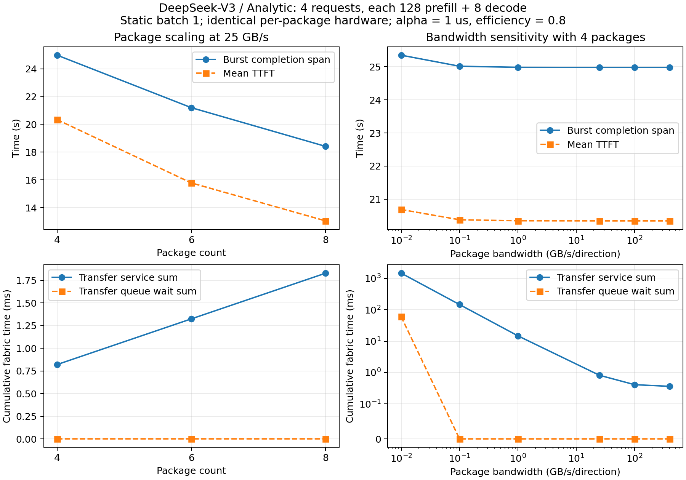

# Package count and bandwidth trends

Detailed reports and synthetic inputs are generated by the commands below;
only compact historical observations are retained here. New output belongs in
ignored `output_sanity_checks/` directories.

The multi-package implementation was reviewed and retained. Two exception-path
cleanup gaps were fixed: trace handles now close after failed output operations,
and failed/interrupted transfers roll back destination capacity while preserving
the producer's copy and releasing endpoint bandwidth. Normal execution timing
is unchanged: all three small backend metrics exactly reproduce the preceding
validation. The suite passes **101 tests with 3 environment-gated skips**;
12 package tests include the new failure cases. A real two-package Garnet run
also completed. The study runner performs the dependency and control audits on each new run.

## Controlled experiment

- Model/backend: full 61-layer DeepSeek-V3 surrogate, HYDRA-Analytic.
- Workload: four synthetic requests, each 128 prefill tokens and
  8 subsequent decode steps; all arrive at time zero, static batch size 1.
- Each package: the same archived 6x4 configuration, 16 x 16-GiB HBMs,
  eight compute chiplets. Only one prefill and one decode chiplet per package
  are attention accelerators used by this model; the six recurrent chiplets
  are retained from the archived design. This is not optimized DeepSeek hardware.
- Package study: 4, 6, 8 packages at 25 GB/s per package per direction.
  More packages add compute and HBM; this is scale-out, not a fixed-resource study.
- Bandwidth study: 0.01, 0.1, 1, 25, 100, 400 GB/s with four packages.
  **Only bandwidth changes**; startup stays 1 us and efficiency stays 0.8.
  The very low rates are deliberately slow stress points, not NVLink claims.

Every point completes **4/4 requests and 36 output tokens**, with no preemption
or unfinished transfers. Static locality, exact payloads, producer/consumer
causality and Tx/Rx serialization are checked. The bandwidth study additionally
checks identical workload, mappings, transfer counts, bytes and compute service.
Total block service sums to **37.418444 s** at every point.

## Results



[Measured CSV](../../../../docs/multi_package/data/package_study.csv).
The script regenerates the synthetic burst, plots, audits and run manifests
in the selected output directory.

| Packages | Mean TTFT (s) | Burst span (s) | Burst TP (tokens/s) | Package traffic (MB) |
|---:|---:|---:|---:|---:|
| 4 | 20.339894 | 24.982015 | 1.4410 | 11.698 |
| 6 | 15.782824 | 21.201127 | 1.6980 | 19.497 |
| 8 | 13.048979 | 18.413939 | 1.9550 | 27.296 |

From four to eight packages, finite-burst throughput improves **35.7%** and
TTFT decreases **35.8%**. Additional stages distribute compute contention across
more accelerators, while each request still traverses all 61 layers. The most
loaded stage's cumulative block service falls from 9.466320 to 5.048704 s.
Scaling is sublinear: only four requests are in flight, the policy has no new
microbatch pipeline scheduler, and stage fill/drain and scheduling waits remain.
More boundaries increase activation traffic and transfer startup costs.

| Configured bandwidth (GB/s) | Mean TTFT (s) | Burst span (s) | Fabric service sum (ms) | Fabric queue sum (ms) |
|---:|---:|---:|---:|---:|
| 0.01 | 20.683354 | 25.352788 | 1462.444 | 59.934 |
| 0.1 | 20.374163 | 25.018920 | 146.440 | 0 |
| 1 | 20.343197 | 24.985510 | 14.800 | 0 |
| 25 | 20.339894 | 24.982015 | 0.820 | 0 |
| 100 | 20.339792 | 24.981913 | 0.412 | 0 |
| 400 | 20.339780 | 24.981901 | 0.364 | 0 |

Fabric serialization drops approximately with inverse bandwidth until startup
and rounding dominate. At the lowest bandwidth, shared ports also queue.
End-to-end gains flatten much earlier because this workload is dominated by
compute/local execution, and layer partitioning only communicates activations
and token IDs. Raising bandwidth from 1 to 25 GB/s saves just **3.495 ms** of
burst span; from 25 to 400 GB/s saves **0.114 ms**. The 400-GB/s setting is capped
at **128 GB/s effective endpoint bandwidth**, and all completions round up to
HYDRA's 1-us resolution. These plateaus are expected under the implemented model.

## Metric scope

Burst span is the time from the first decoder block start to the last decoder
block completion across the four requests. Burst TP is `36 / span`; it excludes
the trailing idle part of the 120-s simulation window. The original fixed-window
metric is 0.3 tokens/s for every point and would hide these trends. Burst TP is
not sustainable serving throughput. TTFT retains HYDRA's scheduling-to-prefill-
completion definition, excluding time in the initial request queue.

Fabric service/queue numbers sum individual messages and may overlap across
ports; they are **not** components to add directly to wall-clock burst span.
Host process times are retained for provenance, but runs used two concurrent
workers and were not a controlled simulator-speed benchmark.

These results support internal consistency and directional behavior for this
small synthetic burst. They do not calibrate physical interconnect accuracy,
establish a general scaling law or represent distributed expert all-to-all.

## Reproduce

Activate the HYDRA Python environment, then run from the repository root:

```bash
python -m unittest discover -s tests

python tests/validation/multi_package/study.py \
  --output-dir output_sanity_checks/packages/trend \
  --report-dir output_sanity_checks/packages/trend/report

# Re-audit and regenerate tables/figures without rerunning simulations.
python tests/validation/multi_package/study.py \
  --output-dir output_sanity_checks/packages/trend \
  --report-dir output_sanity_checks/packages/trend/report --collect-only

# Replay the four-request burst to verify all request memory is reclaimed.
python tests/validation/operator_validation/audit_memory.py \
  --command output_sanity_checks/packages/trend/p4_bw25/deepseek-v3-text/hydra_sim/command.json \
  --output-dir output_sanity_checks/packages/trend_memory
```

Use `--jobs 1` to run sequentially. Each point records its original hardware row,
effective setup, command, source hashes, exact transfers and block times. The
retained raw study used `output_sanity_checks/packages/trend_v1`; curated outputs
are stored here. [Model assumptions](../../../../docs/multi_package/README.md)
and the [three-backend smoke workflow](../README.md) remain applicable.
